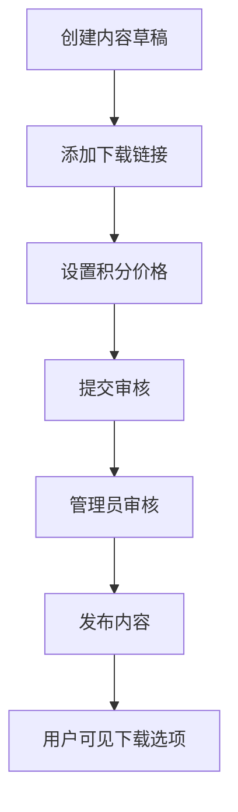
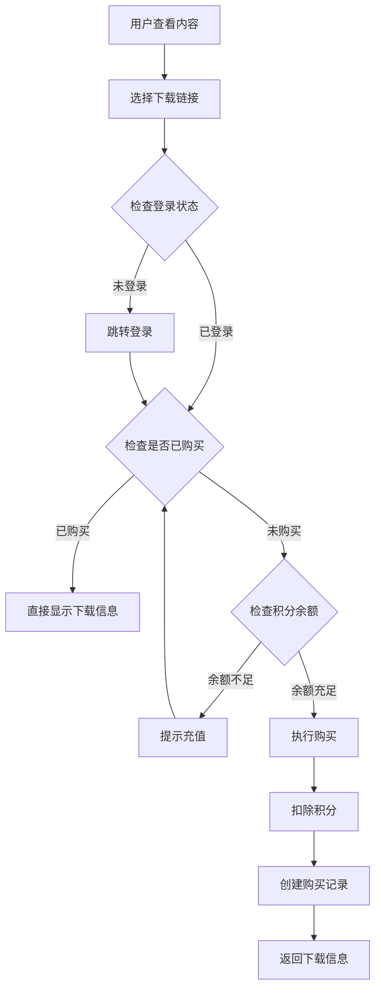
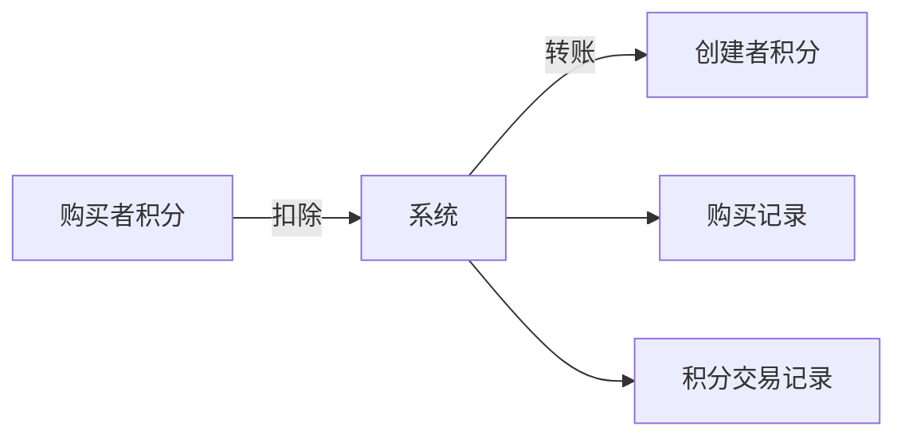

# 下载链接功能技术说明

## 概述

下载链接功能是兔图平台的核心功能之一，允许内容创建者为其发布的内容添加多个下载选项，用户可以使用积分购买下载链接。该功能支持多种网盘平台，实现了完整的积分经济体系。

## 系统架构

### 数据模型

#### 1. DownloadLink 模型
```typescript
model DownloadLink {
  id          Int      @id @default(autoincrement())
  uuid        String   @unique @default(uuid())
  pageId      Int      // 关联的页面ID
  userId      Int      // 创建者用户ID
  platform    String   // 网盘平台类型
  url         String   // 下载链接URL（加密存储）
  extractCode String?  // 提取码（加密存储）
  pointCost   Int      // 所需积分
  title       String   // 链接标题/描述
  description String?  // 详细描述
  isActive    Boolean  @default(true) // 是否启用
  sortOrder   Int      @default(0) // 排序顺序
  createdAt   DateTime @default(now())
  updatedAt   DateTime @updatedAt
  deletedAt   DateTime? // 软删除
}
```

#### 2. DownloadPurchase 模型
```typescript
model DownloadPurchase {
  id           Int          @id @default(autoincrement())
  uuid         String       @unique @default(uuid())
  userId       Int          // 购买用户ID
  downloadId   Int          // 下载链接ID
  pointCost    Int          // 消费的积分
  status       String       @default("COMPLETED") // 购买状态
  accessCount  Int          @default(0) // 访问次数
  lastAccess   DateTime?    // 最后访问时间
  expiresAt    DateTime?    // 访问过期时间（可选）
  createdAt    DateTime     @default(now())
  updatedAt    DateTime     @updatedAt
}
```

### 支持的网盘平台

系统支持以下网盘平台：

| 平台ID | 平台名称 | 图标 | 需要提取码 | URL模式 |
|--------|----------|------|------------|---------|
| telegram | Telegram | 📱 | 否 | `https://t.me/` |
| baidu | 百度网盘 | ☁️ | 是 | `https://pan.baidu.com/` |
| aliyun | 阿里云盘 | 🌐 | 是 | `https://www.aliyundrive.com/` |
| quark | 夸克网盘 | ⚡ | 是 | `https://pan.quark.cn/` |
| googledrive | Google Drive | 📁 | 否 | `https://drive.google.com/` |
| mega | MEGA | 🔒 | 否 | `https://mega.nz/` |
| other | 其他网盘 | 📦 | 是 | 自定义 |

## API 接口

### 1. 获取页面下载链接
```
GET /api/v1/pages/{pageId}/download-links
```

**权限控制：**
- 未登录用户：可查看基本信息（标题、平台、积分）
- 登录用户：可查看基本信息
- 内容创建者：可查看完整信息（包括URL和提取码）

**响应示例：**
```json
{
  "success": true,
  "data": [
    {
      "id": 1,
      "uuid": "xxx-xxx-xxx",
      "platform": "baidu",
      "pointCost": 10,
      "title": "百度网盘下载",
      "description": "完整资源包",
      "isActive": true,
      "sortOrder": 1,
      "createdAt": "2025-05-26T00:00:00.000Z"
    }
  ]
}
```

### 2. 创建下载链接
```
POST /api/v1/pages/{pageId}/download-links
```

**权限要求：** 仅内容创建者

**请求体：**
```json
{
  "platform": "baidu",
  "url": "https://pan.baidu.com/s/example",
  "extractCode": "abc123",
  "pointCost": 10,
  "title": "百度网盘下载",
  "description": "完整资源包",
  "sortOrder": 1
}
```

### 3. 购买下载链接
```
POST /api/v1/download-links/{linkId}/purchase
```

**权限要求：** 登录用户

**业务逻辑：**
1. 检查是否已购买
2. 验证用户积分余额
3. 使用事务处理：
   - 扣除购买者积分
   - 增加创建者积分
   - 创建购买记录
   - 记录积分交易

**响应示例：**
```json
{
  "success": true,
  "data": {
    "purchaseId": "xxx-xxx-xxx",
    "url": "https://pan.baidu.com/s/example",
    "extractCode": "abc123",
    "platform": "baidu",
    "title": "百度网盘下载",
    "pointCost": 10,
    "purchaseDate": "2025-05-26T00:00:00.000Z"
  },
  "message": "购买成功"
}
```

### 4. 获取购买状态
```
GET /api/v1/download-links/{linkId}/purchase
```

**权限要求：** 登录用户

**功能：** 检查用户是否已购买该下载链接，如已购买则返回下载信息

## 安全机制

### 1. 数据加密
- **加密算法：** Base64编码（临时方案，可升级为AES）
- **加密内容：** 下载链接URL和提取码
- **存储方式：** 数据库中存储加密后的数据
- **解密时机：** 仅在用户购买后或创建者查看时解密

### 2. 权限控制
- **查看权限：** 分层权限控制，未登录用户只能看基本信息
- **创建权限：** 仅内容创建者可添加下载链接
- **购买权限：** 仅登录用户可购买
- **管理权限：** 仅创建者可编辑/删除下载链接

### 3. 防重复购买
- **唯一约束：** `userId + downloadId` 组合唯一
- **业务检查：** 购买前检查是否已存在购买记录
- **友好处理：** 重复购买时直接返回已有的下载信息

## 前端组件

### 1. DownloadLinksSection
**文件：** `components/content/DownloadLinksSection.tsx`

**功能：**
- 显示内容页面的下载链接列表
- 处理购买流程
- 显示购买成功模态框
- 支持复制链接和提取码

**关键特性：**
- 响应式设计（移动端友好）
- 实时购买状态检查
- 错误处理和用户反馈
- 支持免费链接（0积分）

### 2. LinkTemplateModal
**文件：** `components/editor/LinkTemplateModal.tsx`

**功能：**
- 内容创建/编辑时管理下载链接
- 支持添加、编辑、删除链接
- 实时预览和验证
- 拖拽排序功能

### 3. DownloadLinksPreview
**文件：** `components/content/DownloadLinksPreview.tsx`

**功能：**
- 在内容列表中预览下载选项
- 显示前3个下载链接
- 积分信息展示

## 业务流程

### 1. 内容发布流程


### 2. 购买流程


### 3. 积分流转


## 错误处理

### 1. 常见错误码
- `UNAUTHORIZED`: 未登录
- `PERMISSION_DENIED`: 权限不足
- `DOWNLOAD_LINK_NOT_FOUND`: 下载链接不存在
- `INSUFFICIENT_POINTS`: 积分不足
- `VALIDATION_ERROR`: 数据验证失败
- `SERVER_ERROR`: 服务器内部错误

### 2. 错误恢复机制
- **网络错误：** 自动重试机制
- **数据不一致：** 事务回滚
- **加密失败：** 降级处理
- **购买失败：** 积分退还

## 性能优化

### 1. 数据库优化
- **索引策略：** pageId, userId, platform, isActive, deletedAt
- **查询优化：** 使用复合索引，避免全表扫描
- **软删除：** 使用deletedAt字段，保留数据完整性

### 2. 缓存策略
- **API缓存：** 下载链接列表缓存60秒
- **购买状态缓存：** 用户购买状态本地缓存
- **平台信息缓存：** 静态平台配置缓存

### 3. 前端优化
- **懒加载：** 购买状态按需加载
- **防抖处理：** 购买按钮防重复点击
- **错误边界：** 组件级错误处理

## 监控和日志

### 1. 关键指标
- 下载链接创建数量
- 购买成功率
- 积分流转金额
- 用户访问频次

### 2. 日志记录
- 购买行为日志
- 错误异常日志
- 性能监控日志
- 安全审计日志

## 未来扩展

### 1. 功能扩展
- 批量下载支持
- 下载链接有效期设置
- 分享链接功能
- 下载统计分析

### 2. 技术升级
- 加密算法升级（AES-256）
- 分布式缓存（Redis）
- 消息队列（购买通知）
- 微服务架构

## 配置说明

### 1. 环境变量
```env
# 加密密钥（生产环境必须设置）
ENCRYPTION_KEY=your-secret-key

# 积分系统配置
MAX_POINT_COST=10000
MIN_POINT_COST=0
```

### 2. 平台配置
平台配置在 `lib/download-platforms.ts` 中维护，支持动态添加新平台。

## 部署注意事项

1. **数据库迁移：** 确保DownloadLink和DownloadPurchase表正确创建
2. **加密密钥：** 生产环境必须设置强密钥
3. **权限配置：** 确认用户角色和权限正确配置
4. **监控告警：** 设置关键业务指标监控

## 快速参考

### 常用API端点
```bash
# 获取页面下载链接
GET /api/v1/pages/{pageId}/download-links

# 创建下载链接
POST /api/v1/pages/{pageId}/download-links

# 购买下载链接
POST /api/v1/download-links/{linkId}/purchase

# 获取购买状态
GET /api/v1/download-links/{linkId}/purchase

# 更新下载链接
PATCH /api/v1/download-links/{linkId}

# 删除下载链接
DELETE /api/v1/download-links/{linkId}
```

### 关键组件导入
```typescript
// 前端组件
import { DownloadLinksSection } from '@/components/content/DownloadLinksSection'
import { LinkTemplateModal } from '@/components/editor/LinkTemplateModal'
import { DownloadLinksPreview } from '@/components/content/DownloadLinksPreview'

// 工具函数
import { encrypt, decrypt } from '@/lib/encryption'
import { getPlatformById, DOWNLOAD_PLATFORMS } from '@/lib/download-platforms'
import { successResponse, errorResponse } from '@/lib/api'
```

### 数据库查询示例
```typescript
// 获取页面的所有下载链接
const downloadLinks = await prisma.downloadLink.findMany({
  where: {
    pageId: pageId,
    deletedAt: null,
    isActive: true
  },
  orderBy: { sortOrder: 'asc' }
})

// 检查用户购买状态
const purchase = await prisma.downloadPurchase.findUnique({
  where: {
    userId_downloadId: {
      userId: userId,
      downloadId: linkId
    }
  }
})
```

### 错误处理模式
```typescript
try {
  // 业务逻辑
  const result = await someOperation()
  return successResponse(res, result, '操作成功')
} catch (error) {
  console.error('操作失败:', error)
  return errorResponse(res, 'OPERATION_FAILED', '操作失败', undefined, 500)
}
```

---

*本文档版本：v1.0*
*最后更新：2025-05-26*
*维护者：兔图开发团队*
