# 兔图项目系统架构与流程图

**版本**: 1.0.0
**最后更新**: 2023-11-16
**维护人**: 技术架构组

## 目录

1. [系统架构图](#1-系统架构图)
2. [数据流程图](#2-数据流程图)
3. [组件关系图](#3-组件关系图)
4. [状态管理流程](#4-状态管理流程)
5. [用户认证流程](#5-用户认证流程)
6. [部署架构图](#6-部署架构图)

## 1. 系统架构图

### 1.1 整体系统架构

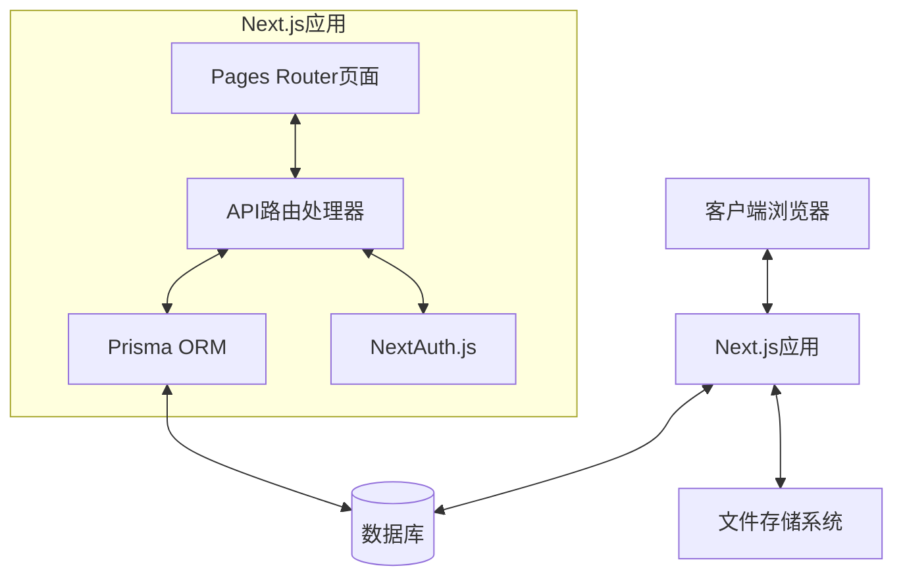

### 1.2 技术栈架构

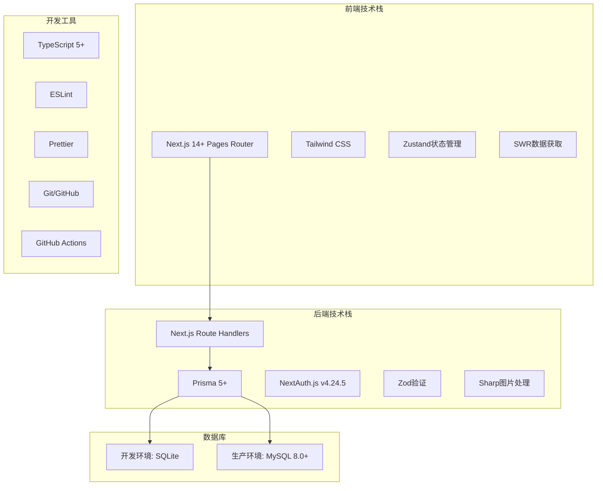

## 2. 数据流程图

### 2.1 前端数据流程

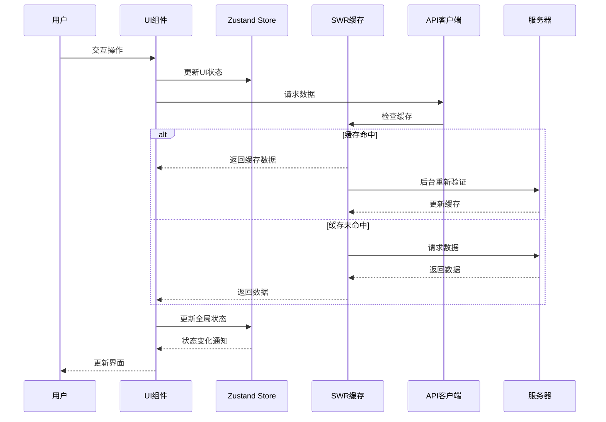

### 2.2 数据创建流程

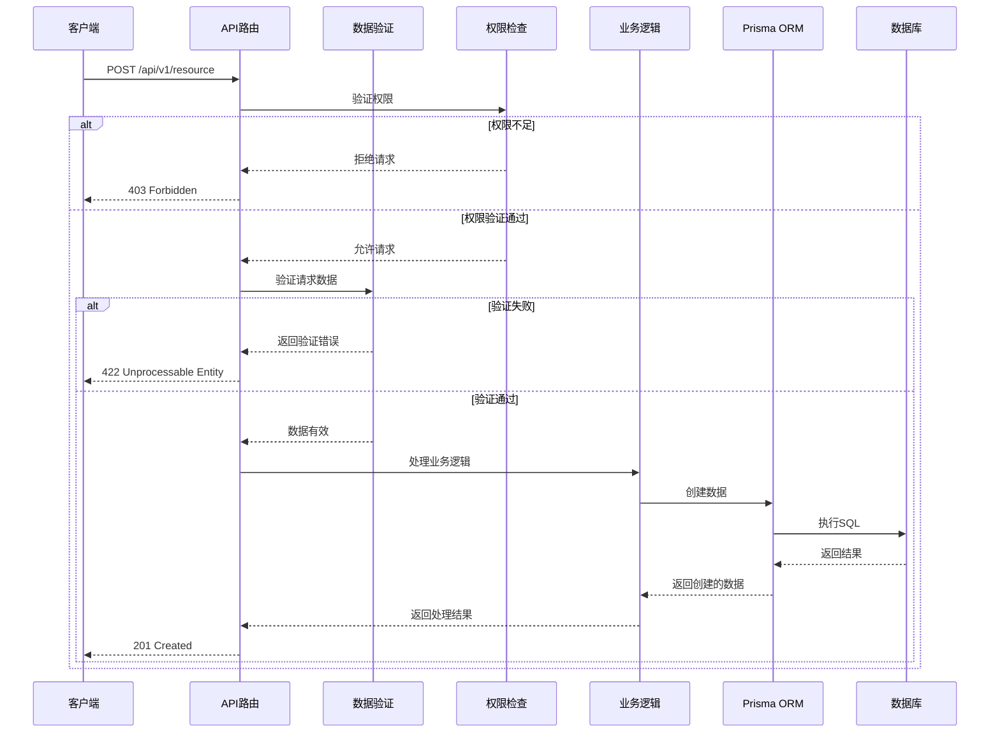

## 3. 组件关系图

### 3.1 前端组件结构

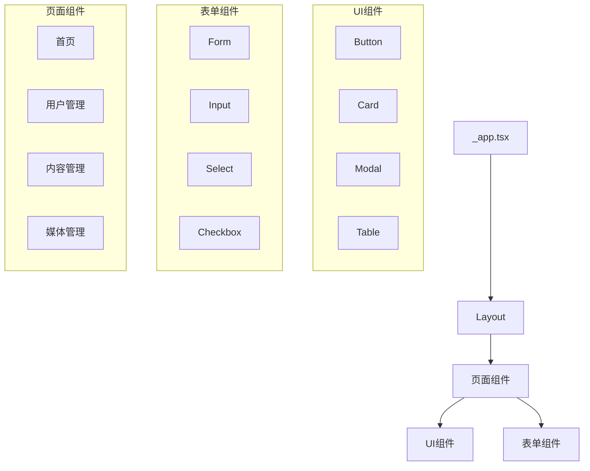

### 3.2 状态管理组件关系

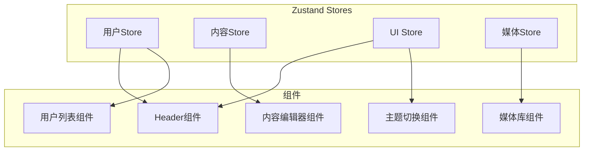

## 4. 状态管理流程

### 4.1 Zustand状态管理流程

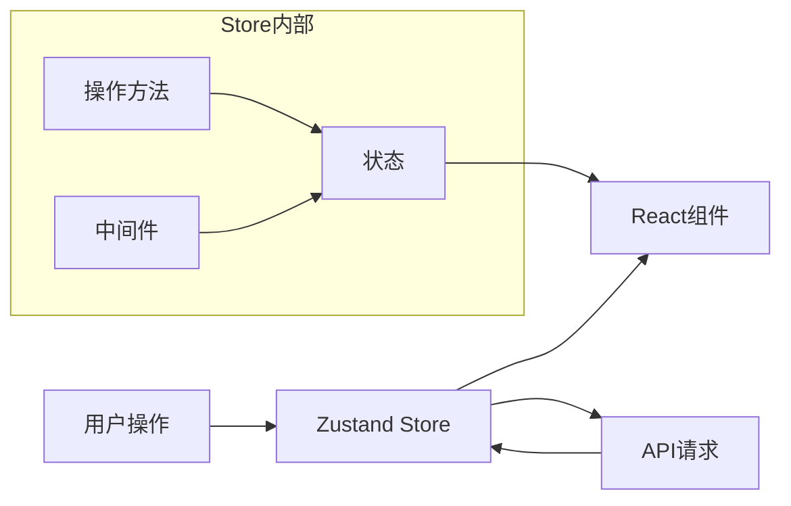

### 4.2 SWR数据获取流程

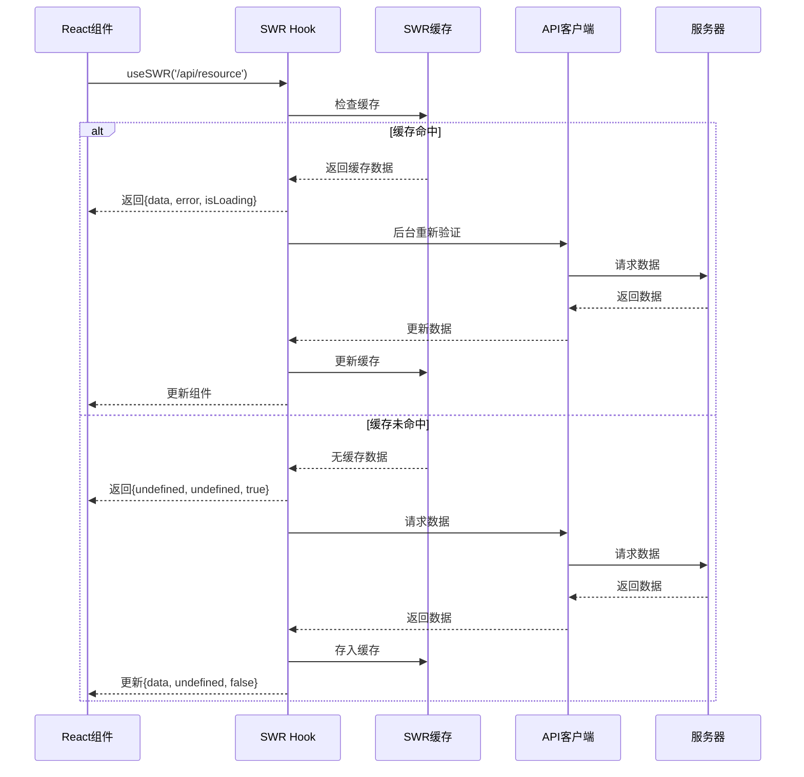

## 5. 用户认证流程

### 5.1 登录流程

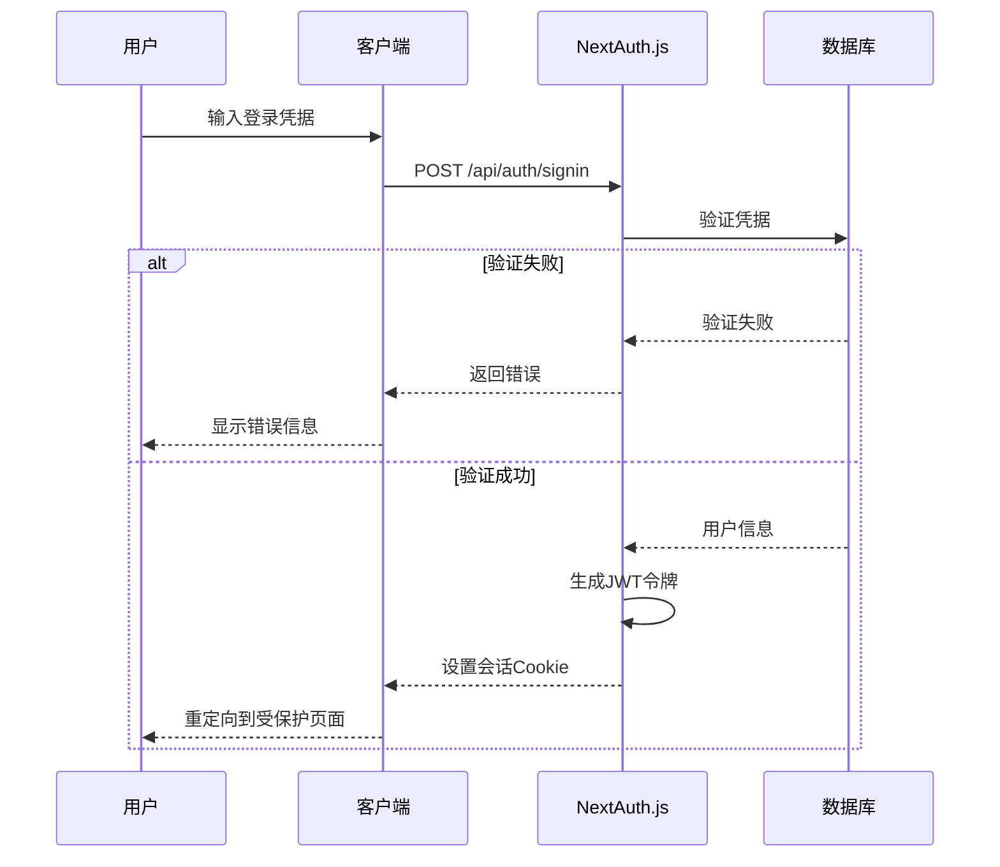

### 5.2 权限检查流程

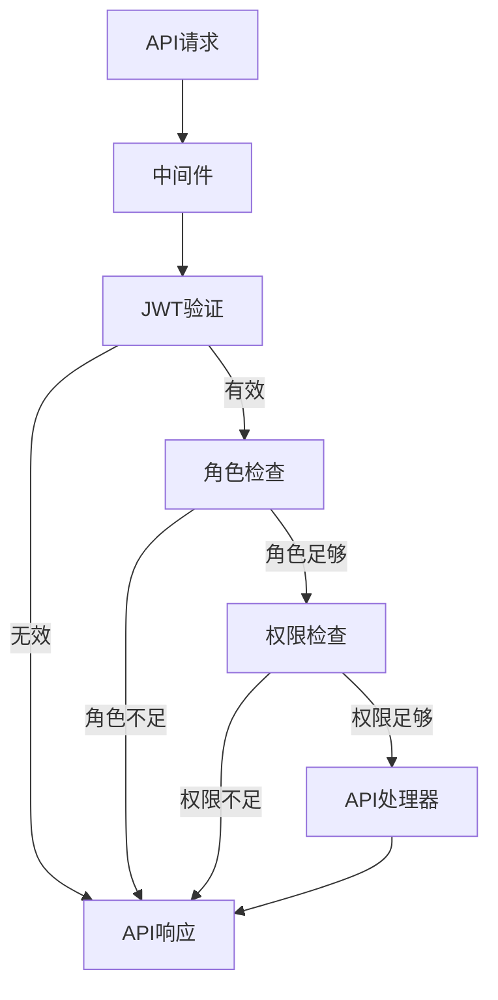

## 6. 部署架构图

### 6.1 生产环境部署架构

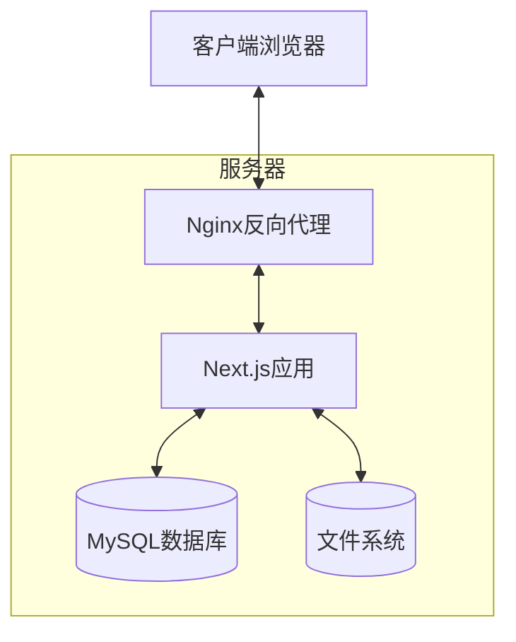

### 6.2 CI/CD流程

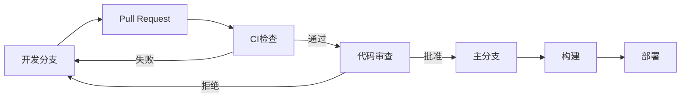

## 版本历史

| 版本 | 日期 | 更新内容 | 更新人 |
|-----|------|---------|-------|
| 1.0.0 | 2023-11-16 | 初始版本 | 技术架构组 |
